# Final Project Submission
* Student name: James M. Irivng, Ph.D.
* Student pace: full time
* Scheduled project review date/time: 05/15/19 2:30 pm
* Instructor name: Jeff Herman / Brandon Lewis

<h1>Table of Contents<span class="tocSkip"></span></h1>
<div class="toc"><ul class="toc-item"><li><span><a href="#Final-Project-Submission" data-toc-modified-id="Final-Project-Submission-1">Final Project Submission</a></span><ul class="toc-item"><li><span><a href="#Iowa-Prisoner-Recidivism-Data" data-toc-modified-id="Iowa-Prisoner-Recidivism-Data-1.1">Iowa Prisoner Recidivism Data</a></span></li></ul></li><li><span><a href="#USING-THE-OSEMN-MODEL-TO-GUIDE-WORKFLOW" data-toc-modified-id="USING-THE-OSEMN-MODEL-TO-GUIDE-WORKFLOW-2">USING THE OSEMN MODEL TO GUIDE WORKFLOW</a></span></li><li><span><a href="#OBTAIN:" data-toc-modified-id="OBTAIN:-3">OBTAIN:</a></span><ul class="toc-item"><li><span><a href="#Importing-Packages" data-toc-modified-id="Importing-Packages-3.1">Importing Packages</a></span></li><li><span><a href="#Loading-data,-preliminary-cleaning" data-toc-modified-id="Loading-data,-preliminary-cleaning-3.2">Loading data, preliminary cleaning</a></span></li></ul></li><li><span><a href="#SCRUB-/-EXPLORE" data-toc-modified-id="SCRUB-/-EXPLORE-4">SCRUB / EXPLORE</a></span><ul class="toc-item"><li><span><a href="#EDA-with-Pandas_Profiling" data-toc-modified-id="EDA-with-Pandas_Profiling-4.1">EDA with Pandas_Profiling</a></span></li><li><span><a href="#ADDRESSING-NULL-VALUES" data-toc-modified-id="ADDRESSING-NULL-VALUES-4.2">ADDRESSING NULL VALUES</a></span></li><li><span><a href="#COMBINING-AND-REMAPPING-CLASSES" data-toc-modified-id="COMBINING-AND-REMAPPING-CLASSES-4.3">COMBINING AND REMAPPING CLASSES</a></span></li><li><span><a href="#ENGINEERING-FEATURES" data-toc-modified-id="ENGINEERING-FEATURES-4.4">ENGINEERING FEATURES</a></span></li><li><span><a href="#Processing-Chosen-Feature-Columns" data-toc-modified-id="Processing-Chosen-Feature-Columns-4.5">Processing Chosen Feature Columns</a></span></li></ul></li><li><span><a href="#FITTING-AN-INITIAL-MODEL" data-toc-modified-id="FITTING-AN-INITIAL-MODEL-5">FITTING AN INITIAL MODEL</a></span></li><li><span><a href="#REVISING-THE-MODEL" data-toc-modified-id="REVISING-THE-MODEL-6">REVISING THE MODEL</a></span><ul class="toc-item"><li><span><a href="#Balancing-Target-Classes-Using-Synthetic-Minority-Oversampling" data-toc-modified-id="Balancing-Target-Classes-Using-Synthetic-Minority-Oversampling-6.1">Balancing Target Classes Using Synthetic Minority Oversampling</a></span></li></ul></li><li><span><a href="#Summary-Visuals" data-toc-modified-id="Summary-Visuals-7">Summary Visuals</a></span></li><li><span><a href="#CONCLUSIONS" data-toc-modified-id="CONCLUSIONS-8">CONCLUSIONS</a></span><ul class="toc-item"><li><span><a href="#Recommendatons" data-toc-modified-id="Recommendatons-8.1">Recommendatons</a></span></li></ul></li><li><span><a href="#FUTURE-DIRECTIONS" data-toc-modified-id="FUTURE-DIRECTIONS-9">FUTURE DIRECTIONS</a></span></li></ul></div>

## Iowa Prisoner Recidivism Data

- Source: https://www.kaggle.com/slonnadube/recidivism-for-offenders-released-from-prison
- **Statistics about recidivism in prisoners from a 3 year prisoner**
- **Target:**
    - Recidivism - Return to Prison
- **Features:**
    - Fiscal Year Released
    - Recidivism Reporting Year
    - Race - Ethnicity
    - Age At Release
    - Convicting Offense Classification
    - Convicting Offense Type
    - Convicting Offense Subtype
    - Main Supervising District
    - Release Type
    - Release type: Paroled to Detainder united
    - Part of Target Population


### Detailed variable descriptions:

- **Fiscal Year Released**
    - Fiscal year (year ending June 30) for which the offender was released from prison.

- **Recidivism Reporting Year**
    - Fiscal year (year ending June 30) that marks the end of the 3-year tracking period. For example, offenders exited prison in FY 2012 are found in recidivism reporting year FY 2015.

- **Race - Ethnicity**
    - Offender's Race and Ethnicity

- **Convicting Offense Classification**
    - Maximum penalties: A Felony = Life; B Felony = 25 or 50 years; C Felony = 10 years; D Felony = 5 years; Aggravated Misdemeanor = 2 years; Serious Misdemeanor = 1 year; Simple Misdemeanor = 30 days

- **Convicting Offense Type**
    - General category for the most serious offense for which the offender was placed in prison.

- **Convicting Offense Subtype**
    - Further classification of the most serious offense for which the offender was placed in prison.

- **Release Type**
    - Reasoning for Offender's release from prison.

- **Main Supervising District**
    - The Judicial District supervising the offender for the longest time during the tracking period.

- **Recidivism - Return to Prison**
    - No = No Recidivism; Yes = Prison admission for any reason within the 3-year tracking period
    
- **Part of Target Population** 
    - The Department of Corrections has undertaken specific strategies to reduce recidivism rates for prisoners who are on parole and are part of the target population.
    ___

# USING THE OSEMN MODEL TO GUIDE WORKFLOW

1. **OBTAIN:**
    - [x] Import data, inspect, check for datatypes to convert and null values
<br><br>

2. **SCRUB: cast data types, identify outliers, check for multicollinearity, normalize data**<br>
    - Check and cast data types
    - [x] Check for missing values 
    - [x] Check for multicollinearity
    - [x] Normalize data (may want to do after some exploring)   
    <br><br>
            
3. **EXPLORE:Check distributions, outliers, etc**
    - [x] Check scales, ranges (df.describe())
    - [x] Check histograms to get an idea of distributions (df.hist()) and data transformations to perform
    - [x] Use scatterplots to check for linearity and possible categorical variables (df.plot(kind-'scatter')
    <br><br>

   
4. **FIT AN INITIAL MODEL:** 
    - [x] Assess the model.
        <br><br>
5. **REVISE THE FITTED MODEL**
    - [x] Adjust chosen model and hyper-parameters
    <br><br>
6. **HOLDOUT VALIDATION**
    - [ ] Perform cross-validation
___

# OBTAIN:

## Importing Packages
- Importing custom functions from `functions_for_project.py` as `ji`
- Importing functions from my personal PyPi Package `bs_ds`


```python
# Import custom functions for project
import functions_for_project as ji

# Import custom python package BroadSteel DataScience (bs_ds_)
from bs_ds.imports import *
from bs_ds import inspect_df, check_null, check_unique, check_column, check_numeric, big_pandas, ignore_warnings

# Turning off warnings for function deprecations
import warnings
warnings.filterwarnings('ignore')

plt.style.use('seaborn-poster')
# Adding CSS styled tables 
bs.html_on(CSS=['body{ text-align: center}'])
```

    bs_ds  v0.9.10 loaded.  Read the docs: https://bs-ds.readthedocs.io/en/latest/index.html
    For convenient loading of standard modules use: from bs_ds.imports import *
    
    


<style  type="text/css" >
</style><table id="T_e001097e_d453_11e9_9950_f48e38b6371f" ><caption>Loaded Packages and Handles</caption><thead>    <tr>        <th class="col_heading level0 col0" >Package</th>        <th class="col_heading level0 col1" >Handle</th>        <th class="col_heading level0 col2" >Description</th>    </tr></thead><tbody>
                <tr>
                                <td id="T_e001097e_d453_11e9_9950_f48e38b6371frow0_col0" class="data row0 col0" >bs_ds</td>
                        <td id="T_e001097e_d453_11e9_9950_f48e38b6371frow0_col1" class="data row0 col1" >bs</td>
                        <td id="T_e001097e_d453_11e9_9950_f48e38b6371frow0_col2" class="data row0 col2" >Custom data science bootcamp student package</td>
            </tr>
            <tr>
                                <td id="T_e001097e_d453_11e9_9950_f48e38b6371frow1_col0" class="data row1 col0" >matplotlib</td>
                        <td id="T_e001097e_d453_11e9_9950_f48e38b6371frow1_col1" class="data row1 col1" >mpl</td>
                        <td id="T_e001097e_d453_11e9_9950_f48e38b6371frow1_col2" class="data row1 col2" >Matplotlib's base OOP module with formatting artists</td>
            </tr>
            <tr>
                                <td id="T_e001097e_d453_11e9_9950_f48e38b6371frow2_col0" class="data row2 col0" >matplotlib.pyplot</td>
                        <td id="T_e001097e_d453_11e9_9950_f48e38b6371frow2_col1" class="data row2 col1" >plt</td>
                        <td id="T_e001097e_d453_11e9_9950_f48e38b6371frow2_col2" class="data row2 col2" >Matplotlib's matlab-like plotting module</td>
            </tr>
            <tr>
                                <td id="T_e001097e_d453_11e9_9950_f48e38b6371frow3_col0" class="data row3 col0" >numpy</td>
                        <td id="T_e001097e_d453_11e9_9950_f48e38b6371frow3_col1" class="data row3 col1" >np</td>
                        <td id="T_e001097e_d453_11e9_9950_f48e38b6371frow3_col2" class="data row3 col2" >scientific computing with Python</td>
            </tr>
            <tr>
                                <td id="T_e001097e_d453_11e9_9950_f48e38b6371frow4_col0" class="data row4 col0" >pandas</td>
                        <td id="T_e001097e_d453_11e9_9950_f48e38b6371frow4_col1" class="data row4 col1" >pd</td>
                        <td id="T_e001097e_d453_11e9_9950_f48e38b6371frow4_col2" class="data row4 col2" >High performance data structures and tools</td>
            </tr>
            <tr>
                                <td id="T_e001097e_d453_11e9_9950_f48e38b6371frow5_col0" class="data row5 col0" >seaborn</td>
                        <td id="T_e001097e_d453_11e9_9950_f48e38b6371frow5_col1" class="data row5 col1" >sns</td>
                        <td id="T_e001097e_d453_11e9_9950_f48e38b6371frow5_col2" class="data row5 col2" >High-level data visualization library based on matplotlib</td>
            </tr>
    </tbody></table>


<style>['body{ text-align: center}']</style>


```python
## Display interactive menu of code used
bs.ihelp_menu([bs.inspect_df,bs.check_null,bs.check_numeric,
              bs.drop_cols])
```


    GridBox(box_style='warning', children=(HBox(children=(Label(value='Function Menu'), Dropdown(options=('inspect…


    Output()


## Loading data, preliminary cleaning

- **Dataset contains detailed columns about the new crime, which we do not need**
    - All of these columns are dropped
- **Replace long column names with shorter nicknames**


```python
# Dataset Links
full_all_prisoners_file = "datasets/FULL_3-Year_Recidivism_for_Offenders_Released_from_Prison_in_Iowa.csv"
# only_repeat_criminals_w_new_crime_file= "datasets/prison_recidivists_with_recidivism_type_only.csv"

# Will be using the all_prisoners file to predict recidivism
df = pd.read_csv(full_all_prisoners_file)

df = bs.drop_cols(df, ['New','Days','Recidivism Type'])
```


```python
# New short-hand names to use
colnames_short = ('yr_released','report_year','race_ethnicity',
                  'age_released','crime_class','crime_type',
                  'crime_subtype','release_type','super_dist',
                  'recidivist','target_pop','sex')

# Zipping the original and new into a renaming dictionary
column_legend = dict(zip(df.columns,colnames_short))

# Rename df with shorter names
df.rename(mapper=column_legend, axis=1, inplace=True)
df.head()
```


<div>
<style scoped>
    .dataframe tbody tr th:only-of-type {
        vertical-align: middle;
    }

    .dataframe tbody tr th {
        vertical-align: top;
    }

    .dataframe thead th {
        text-align: right;
    }
</style>
<table border="1" class="dataframe">
  <thead>
    <tr style="text-align: right;">
      <th></th>
      <th>yr_released</th>
      <th>report_year</th>
      <th>race_ethnicity</th>
      <th>age_released</th>
      <th>crime_class</th>
      <th>crime_type</th>
      <th>crime_subtype</th>
      <th>release_type</th>
      <th>super_dist</th>
      <th>recidivist</th>
      <th>target_pop</th>
      <th>sex</th>
    </tr>
  </thead>
  <tbody>
    <tr>
      <th>0</th>
      <td>2010</td>
      <td>2013</td>
      <td>Black - Non-Hispanic</td>
      <td>25-34</td>
      <td>C Felony</td>
      <td>Violent</td>
      <td>Robbery</td>
      <td>Parole</td>
      <td>7JD</td>
      <td>Yes</td>
      <td>Yes</td>
      <td>Male</td>
    </tr>
    <tr>
      <th>1</th>
      <td>2010</td>
      <td>2013</td>
      <td>White - Non-Hispanic</td>
      <td>25-34</td>
      <td>D Felony</td>
      <td>Property</td>
      <td>Theft</td>
      <td>Discharged – End of Sentence</td>
      <td>NaN</td>
      <td>Yes</td>
      <td>No</td>
      <td>Male</td>
    </tr>
    <tr>
      <th>2</th>
      <td>2010</td>
      <td>2013</td>
      <td>White - Non-Hispanic</td>
      <td>35-44</td>
      <td>B Felony</td>
      <td>Drug</td>
      <td>Trafficking</td>
      <td>Parole</td>
      <td>5JD</td>
      <td>Yes</td>
      <td>Yes</td>
      <td>Male</td>
    </tr>
    <tr>
      <th>3</th>
      <td>2010</td>
      <td>2013</td>
      <td>White - Non-Hispanic</td>
      <td>25-34</td>
      <td>B Felony</td>
      <td>Other</td>
      <td>Other Criminal</td>
      <td>Parole</td>
      <td>6JD</td>
      <td>No</td>
      <td>Yes</td>
      <td>Male</td>
    </tr>
    <tr>
      <th>4</th>
      <td>2010</td>
      <td>2013</td>
      <td>Black - Non-Hispanic</td>
      <td>35-44</td>
      <td>D Felony</td>
      <td>Violent</td>
      <td>Assault</td>
      <td>Discharged – End of Sentence</td>
      <td>NaN</td>
      <td>Yes</td>
      <td>No</td>
      <td>Male</td>
    </tr>
  </tbody>
</table>
</div>


# SCRUB / EXPLORE
## EDA with Pandas_Profiling


```python
# import pandas_profiling as pp
# profile = pp.ProfileReport(df,style={'full_width':True})
# profile.to_file(output_file='profile_report.html')
```

## ADDRESSING NULL VALUES


```python
bs.column_report(df, as_df=True);#check_null(df)
```


<div>
<style scoped>
    .dataframe tbody tr th:only-of-type {
        vertical-align: middle;
    }

    .dataframe tbody tr th {
        vertical-align: top;
    }

    .dataframe thead th {
        text-align: right;
    }
</style>
<table border="1" class="dataframe">
  <thead>
    <tr style="text-align: right;">
      <th></th>
      <th>column name</th>
      <th>dtypes</th>
      <th># zeros</th>
      <th># null</th>
      <th>% null</th>
      <th>Notes</th>
    </tr>
    <tr>
      <th>.iloc[:,i]</th>
      <th></th>
      <th></th>
      <th></th>
      <th></th>
      <th></th>
      <th></th>
    </tr>
  </thead>
  <tbody>
    <tr>
      <th>0</th>
      <td>yr_released</td>
      <td>int64</td>
      <td>0.0</td>
      <td>0</td>
      <td>0.00</td>
      <td></td>
    </tr>
    <tr>
      <th>1</th>
      <td>report_year</td>
      <td>int64</td>
      <td>0.0</td>
      <td>0</td>
      <td>0.00</td>
      <td></td>
    </tr>
    <tr>
      <th>2</th>
      <td>race_ethnicity</td>
      <td>object</td>
      <td>0.0</td>
      <td>30</td>
      <td>0.12</td>
      <td></td>
    </tr>
    <tr>
      <th>3</th>
      <td>age_released</td>
      <td>object</td>
      <td>0.0</td>
      <td>3</td>
      <td>0.01</td>
      <td></td>
    </tr>
    <tr>
      <th>4</th>
      <td>crime_class</td>
      <td>object</td>
      <td>0.0</td>
      <td>0</td>
      <td>0.00</td>
      <td></td>
    </tr>
    <tr>
      <th>5</th>
      <td>crime_type</td>
      <td>object</td>
      <td>0.0</td>
      <td>0</td>
      <td>0.00</td>
      <td></td>
    </tr>
    <tr>
      <th>6</th>
      <td>crime_subtype</td>
      <td>object</td>
      <td>0.0</td>
      <td>0</td>
      <td>0.00</td>
      <td></td>
    </tr>
    <tr>
      <th>7</th>
      <td>release_type</td>
      <td>object</td>
      <td>0.0</td>
      <td>1762</td>
      <td>6.77</td>
      <td></td>
    </tr>
    <tr>
      <th>8</th>
      <td>super_dist</td>
      <td>object</td>
      <td>0.0</td>
      <td>9581</td>
      <td>36.82</td>
      <td></td>
    </tr>
    <tr>
      <th>9</th>
      <td>recidivist</td>
      <td>object</td>
      <td>0.0</td>
      <td>0</td>
      <td>0.00</td>
      <td></td>
    </tr>
    <tr>
      <th>10</th>
      <td>target_pop</td>
      <td>object</td>
      <td>0.0</td>
      <td>0</td>
      <td>0.00</td>
      <td></td>
    </tr>
    <tr>
      <th>11</th>
      <td>sex</td>
      <td>object</td>
      <td>0.0</td>
      <td>3</td>
      <td>0.01</td>
      <td></td>
    </tr>
  </tbody>
</table>
</div>


**Results of Null Check**

- Null values that represent <10% of data will be dropped.
    - `race_ethnicity` has 30 (0.12%), `age_released` has 3 (0.01%),`sex` has 3 (0.01% of data),`release_type` has 1762 (6.77% of data)
    
- `super_district` has 9581(36.82% of data)
    - replace with "unknown"
  


```python
# Filling NA's in super_dist and release_type
df.dropna(subset=['age_released','race_ethnicity','sex','release_type'],inplace=True)
df['super_dist'].fillna("unknown", inplace=True)

report = bs.column_report(df,as_df=True)
```


<div>
<style scoped>
    .dataframe tbody tr th:only-of-type {
        vertical-align: middle;
    }

    .dataframe tbody tr th {
        vertical-align: top;
    }

    .dataframe thead th {
        text-align: right;
    }
</style>
<table border="1" class="dataframe">
  <thead>
    <tr style="text-align: right;">
      <th></th>
      <th>column name</th>
      <th>dtypes</th>
      <th># zeros</th>
      <th># null</th>
      <th>% null</th>
      <th>Notes</th>
    </tr>
    <tr>
      <th>.iloc[:,i]</th>
      <th></th>
      <th></th>
      <th></th>
      <th></th>
      <th></th>
      <th></th>
    </tr>
  </thead>
  <tbody>
    <tr>
      <th>0</th>
      <td>yr_released</td>
      <td>int64</td>
      <td>0.0</td>
      <td>0</td>
      <td>0.0</td>
      <td></td>
    </tr>
    <tr>
      <th>1</th>
      <td>report_year</td>
      <td>int64</td>
      <td>0.0</td>
      <td>0</td>
      <td>0.0</td>
      <td></td>
    </tr>
    <tr>
      <th>2</th>
      <td>race_ethnicity</td>
      <td>object</td>
      <td>0.0</td>
      <td>0</td>
      <td>0.0</td>
      <td></td>
    </tr>
    <tr>
      <th>3</th>
      <td>age_released</td>
      <td>object</td>
      <td>0.0</td>
      <td>0</td>
      <td>0.0</td>
      <td></td>
    </tr>
    <tr>
      <th>4</th>
      <td>crime_class</td>
      <td>object</td>
      <td>0.0</td>
      <td>0</td>
      <td>0.0</td>
      <td></td>
    </tr>
    <tr>
      <th>5</th>
      <td>crime_type</td>
      <td>object</td>
      <td>0.0</td>
      <td>0</td>
      <td>0.0</td>
      <td></td>
    </tr>
    <tr>
      <th>6</th>
      <td>crime_subtype</td>
      <td>object</td>
      <td>0.0</td>
      <td>0</td>
      <td>0.0</td>
      <td></td>
    </tr>
    <tr>
      <th>7</th>
      <td>release_type</td>
      <td>object</td>
      <td>0.0</td>
      <td>0</td>
      <td>0.0</td>
      <td></td>
    </tr>
    <tr>
      <th>8</th>
      <td>super_dist</td>
      <td>object</td>
      <td>0.0</td>
      <td>0</td>
      <td>0.0</td>
      <td></td>
    </tr>
    <tr>
      <th>9</th>
      <td>recidivist</td>
      <td>object</td>
      <td>0.0</td>
      <td>0</td>
      <td>0.0</td>
      <td></td>
    </tr>
    <tr>
      <th>10</th>
      <td>target_pop</td>
      <td>object</td>
      <td>0.0</td>
      <td>0</td>
      <td>0.0</td>
      <td></td>
    </tr>
    <tr>
      <th>11</th>
      <td>sex</td>
      <td>object</td>
      <td>0.0</td>
      <td>0</td>
      <td>0.0</td>
      <td></td>
    </tr>
  </tbody>
</table>
</div>


___
## COMBINING AND REMAPPING CLASSES

### df['race_ethnicity']

- **Remapping race_ethnicity**
    - Due to the low numbers for several of the race_ethnicity types, reducing and combining Hispanic and Non-Hispanic groups
    - Alternative approach of separating race and ethnicity into 2 separate features was rejected after modeling


```python
check_unique(df,['race_ethnicity'])
```

    
    ---------------------------
    
    race_ethnicity Type: object
    Number unique values: 11.
    


<div>
<style scoped>
    .dataframe tbody tr th:only-of-type {
        vertical-align: middle;
    }

    .dataframe tbody tr th {
        vertical-align: top;
    }

    .dataframe thead th {
        text-align: right;
    }
</style>
<table border="1" class="dataframe">
  <thead>
    <tr style="text-align: right;">
      <th></th>
      <th>race_ethnicity</th>
    </tr>
  </thead>
  <tbody>
    <tr>
      <th>White - Non-Hispanic</th>
      <td>16460</td>
    </tr>
    <tr>
      <th>Black - Non-Hispanic</th>
      <td>5687</td>
    </tr>
    <tr>
      <th>White - Hispanic</th>
      <td>1365</td>
    </tr>
    <tr>
      <th>American Indian or Alaska Native - Non-Hispanic</th>
      <td>463</td>
    </tr>
    <tr>
      <th>Asian or Pacific Islander - Non-Hispanic</th>
      <td>175</td>
    </tr>
    <tr>
      <th>Black - Hispanic</th>
      <td>36</td>
    </tr>
    <tr>
      <th>American Indian or Alaska Native - Hispanic</th>
      <td>19</td>
    </tr>
    <tr>
      <th>White -</th>
      <td>12</td>
    </tr>
    <tr>
      <th>Asian or Pacific Islander - Hispanic</th>
      <td>5</td>
    </tr>
    <tr>
      <th>Black -</th>
      <td>2</td>
    </tr>
    <tr>
      <th>N/A -</th>
      <td>1</td>
    </tr>
  </tbody>
</table>
</div>


```python
# Defining Dictionary Map for race_ethnicity categories
race_ethnicity_map = {'White - Non-Hispanic':'White',
                        'Black - Non-Hispanic': 'Black',
                        'White - Hispanic' : 'Hispanic',
                        'American Indian or Alaska Native - Non-Hispanic' : 'American Native',
                        'Asian or Pacific Islander - Non-Hispanic' : 'Asian or Pacific Islander',
                        'Black - Hispanic' : 'Black',
                        'American Indian or Alaska Native - Hispanic':'American Native',
                        'White -' : 'White',
                        'Asian or Pacific Islander - Hispanic' : 'Asian or Pacific Islander',
                        'N/A -' : np.nan,
                        'Black -':'Black'}

# Replacing original race_ethnicity column with remapped one.
df['race_ethnicity'] = df['race_ethnicity'].map(race_ethnicity_map)
```

### df['crime_class']

- **Remapping crime_class**
    - Combine 'Other Felony' and 'Other Felony (Old Code)' -> nan
    - Other Misdemeanor -> np.nan
    - Felony - Mandatory Minimum -> np.nan
    - Special Sentence 2005 -> Sex Offender
    - 'Sexual Predator Community Supervision' -> 'Sex Offender'
    - Other Felony -> np.nan    


```python
check_unique(df,['crime_class'])
```

    
    ---------------------------
    
    crime_class Type: object
    Number unique values: 14.
    


<div>
<style scoped>
    .dataframe tbody tr th:only-of-type {
        vertical-align: middle;
    }

    .dataframe tbody tr th {
        vertical-align: top;
    }

    .dataframe thead th {
        text-align: right;
    }
</style>
<table border="1" class="dataframe">
  <thead>
    <tr style="text-align: right;">
      <th></th>
      <th>crime_class</th>
    </tr>
  </thead>
  <tbody>
    <tr>
      <th>D Felony</th>
      <td>9786</td>
    </tr>
    <tr>
      <th>C Felony</th>
      <td>6453</td>
    </tr>
    <tr>
      <th>Aggravated Misdemeanor</th>
      <td>4327</td>
    </tr>
    <tr>
      <th>B Felony</th>
      <td>1716</td>
    </tr>
    <tr>
      <th>Felony - Enhancement to Original Penalty</th>
      <td>1488</td>
    </tr>
    <tr>
      <th>Felony - Enhanced</th>
      <td>220</td>
    </tr>
    <tr>
      <th>Serious Misdemeanor</th>
      <td>139</td>
    </tr>
    <tr>
      <th>Special Sentence 2005</th>
      <td>69</td>
    </tr>
    <tr>
      <th>Felony - Mandatory Minimum</th>
      <td>10</td>
    </tr>
    <tr>
      <th>Other Felony</th>
      <td>6</td>
    </tr>
    <tr>
      <th>A Felony</th>
      <td>4</td>
    </tr>
    <tr>
      <th>Simple Misdemeanor</th>
      <td>3</td>
    </tr>
    <tr>
      <th>Sexual Predator Community Supervision</th>
      <td>2</td>
    </tr>
    <tr>
      <th>Other Felony (Old Code)</th>
      <td>2</td>
    </tr>
  </tbody>
</table>
</div>


```python
# Remapping
crime_class_map = {'Other Felony (Old Code)': np.nan ,#or other felony
                  'Other Misdemeanor':np.nan,
                   'Felony - Mandatory Minimum':np.nan, # if minimum then lowest sentence ==  D Felony
                   'Special Sentence 2005': 'Sex Offender',
                   'Other Felony' : np.nan ,
                   'Sexual Predator Community Supervision' : 'Sex Offender',
                   'D Felony': 'D Felony',
                   'C Felony' :'C Felony',
                   'B Felony' : 'B Felony',
                   'A Felony' : 'A Felony',
                   'Aggravated Misdemeanor':'Aggravated Misdemeanor',
                   'Felony - Enhancement to Original Penalty':'Felony - Enhanced',
                   'Felony - Enhanced':'Felony - Enhanced' ,
                   'Serious Misdemeanor':'Serious Misdemeanor',
                   'Simple Misdemeanor':'Simple Misdemeanor'}

df['crime_class'] = df['crime_class'].map(crime_class_map)
```

### df['age_released']

- **Encoding age groups as ordinal**


```python
# Encoding age groups as ordinal
age_map ={"Under 25": 0,
          "25-34": 1, 
          "35-44": 2, 
          "45-54": 3,
          "55 and Older": 4}

# Mapping age_map onto 'age_released'
df['age_released'] = df['age_released'].map(age_map)
```

### Remapping binary categories df[['recidivist','target_pop','sex']]


```python
## Remapping binary categories

# Recidivist
recidivist_map = {'No':0,
                  'Yes':1 }
df['recidivist'] = df['recidivist'].map(recidivist_map)

# Target_pop
target_pop_map = {'No':0,
                  'Yes':1}
df['target_pop'] = df['target_pop'].map(target_pop_map)

# Sex
sex_map = {'Male':0,
           'Female':1}
df['sex'] = df['sex'].map(sex_map)
```

___
## ENGINEERING FEATURES
- **We wanted to better represent the severity of the crimes as something other than just unordered categories. <br> To do so, we engineered additional features.**
    - `felony`=  true / false category
    - `max_sentence` = mapping approximate maximum sentences to crime classes. 
    
- **Additionally, we combined crime_type and crime_subtype into one feature to reduce dimensionality.**
    - `crime_types_combined` = crime_type and crime_subtype into types_combined
    - `crime_class_type_subtype` = crime_class, type, and subtype combined


```python
# Engineering a simple 'felony' true false category
df['felony'] = np.where(df['crime_class'].str.contains('felony',case=False),1,0)

# Mapping years onto crime class
crime_class_max_sentence_map = {'A Felony': 75,  # Life
                                'Aggravated Misdemeanor': 2, # 2 years
                                'B Felony': 50, # 25 or 50 years
                                'C Felony': 10, # 10 years
                                'D Felony': 5,  # 5 yeras
                                'Felony - Enhanced': 10, # Add on to class C and D felonies, hard to approximate. 
                                'Serious Misdemeanor': 1, # 1 year
                                'Sex Offender': 10, # 10 years
                                'Simple Misdemeanor': 0.83} # 30 days

# Mapping max_sentence_column
df['max_sentence'] =df['crime_class'].map(crime_class_max_sentence_map)

## Creating combined classes and types
df['crime_types_combined'] = df['crime_type']+'_'+df['crime_subtype']

# Combining crime_type and crime_subtype into types_combined
df['crime_class_type_subtype']= df['crime_class']+'_'+df['crime_type']+'_'+df['crime_subtype']
```


```python
## Dropping null values filled in during feature remapping
df.dropna(inplace=True)
df.reset_index(inplace=True)

df.to_csv('Iowa_recidivism_features_pre-processing.csv')
df.head()
```


<div>
<style scoped>
    .dataframe tbody tr th:only-of-type {
        vertical-align: middle;
    }

    .dataframe tbody tr th {
        vertical-align: top;
    }

    .dataframe thead th {
        text-align: right;
    }
</style>
<table border="1" class="dataframe">
  <thead>
    <tr style="text-align: right;">
      <th></th>
      <th>index</th>
      <th>yr_released</th>
      <th>report_year</th>
      <th>race_ethnicity</th>
      <th>age_released</th>
      <th>crime_class</th>
      <th>crime_type</th>
      <th>crime_subtype</th>
      <th>release_type</th>
      <th>super_dist</th>
      <th>recidivist</th>
      <th>target_pop</th>
      <th>sex</th>
      <th>felony</th>
      <th>max_sentence</th>
      <th>crime_types_combined</th>
      <th>crime_class_type_subtype</th>
    </tr>
  </thead>
  <tbody>
    <tr>
      <th>0</th>
      <td>0</td>
      <td>2010</td>
      <td>2013</td>
      <td>Black</td>
      <td>1</td>
      <td>C Felony</td>
      <td>Violent</td>
      <td>Robbery</td>
      <td>Parole</td>
      <td>7JD</td>
      <td>1</td>
      <td>1</td>
      <td>0</td>
      <td>1</td>
      <td>10.0</td>
      <td>Violent_Robbery</td>
      <td>C Felony_Violent_Robbery</td>
    </tr>
    <tr>
      <th>1</th>
      <td>1</td>
      <td>2010</td>
      <td>2013</td>
      <td>White</td>
      <td>1</td>
      <td>D Felony</td>
      <td>Property</td>
      <td>Theft</td>
      <td>Discharged – End of Sentence</td>
      <td>unknown</td>
      <td>1</td>
      <td>0</td>
      <td>0</td>
      <td>1</td>
      <td>5.0</td>
      <td>Property_Theft</td>
      <td>D Felony_Property_Theft</td>
    </tr>
    <tr>
      <th>2</th>
      <td>2</td>
      <td>2010</td>
      <td>2013</td>
      <td>White</td>
      <td>2</td>
      <td>B Felony</td>
      <td>Drug</td>
      <td>Trafficking</td>
      <td>Parole</td>
      <td>5JD</td>
      <td>1</td>
      <td>1</td>
      <td>0</td>
      <td>1</td>
      <td>50.0</td>
      <td>Drug_Trafficking</td>
      <td>B Felony_Drug_Trafficking</td>
    </tr>
    <tr>
      <th>3</th>
      <td>3</td>
      <td>2010</td>
      <td>2013</td>
      <td>White</td>
      <td>1</td>
      <td>B Felony</td>
      <td>Other</td>
      <td>Other Criminal</td>
      <td>Parole</td>
      <td>6JD</td>
      <td>0</td>
      <td>1</td>
      <td>0</td>
      <td>1</td>
      <td>50.0</td>
      <td>Other_Other Criminal</td>
      <td>B Felony_Other_Other Criminal</td>
    </tr>
    <tr>
      <th>4</th>
      <td>4</td>
      <td>2010</td>
      <td>2013</td>
      <td>Black</td>
      <td>2</td>
      <td>D Felony</td>
      <td>Violent</td>
      <td>Assault</td>
      <td>Discharged – End of Sentence</td>
      <td>unknown</td>
      <td>1</td>
      <td>0</td>
      <td>0</td>
      <td>1</td>
      <td>5.0</td>
      <td>Violent_Assault</td>
      <td>D Felony_Violent_Assault</td>
    </tr>
  </tbody>
</table>
</div>


## Processing Chosen Feature Columns


```python
# List of features to be analyzed as categories
category_cols = ['yr_released','race_ethnicity', 'crime_class',
                 'release_type','crime_type','crime_subtype',
                 'target_pop','sex','super_dist','felony']

# List of features to be analzyed as numbers
number_cols = ['max_sentence','age_released']

# Target feature
target_col = ['recidivist']
```


```python
# Creating new dataframe ('df_to_split') to contain processed features for train_test_split
df_to_split=pd.DataFrame()

## MinMaxing Numerical Columns
from sklearn.preprocessing import MinMaxScaler
sca = MinMaxScaler()

for header in number_cols:
    print(header)
    data = np.array(df[header])
    res = sca.fit_transform(data.reshape(-1,1))
    df_to_split[header] = res.ravel()    


## Convert categories to cat.codes
for header in category_cols:
    df_to_split[header] = df[header].astype('category').cat.codes
    
df_to_split.info()
```

    max_sentence
    age_released
    <class 'pandas.core.frame.DataFrame'>
    RangeIndex: 24206 entries, 0 to 24205
    Data columns (total 12 columns):
    max_sentence      24206 non-null float64
    age_released      24206 non-null float64
    yr_released       24206 non-null int8
    race_ethnicity    24206 non-null int8
    crime_class       24206 non-null int8
    release_type      24206 non-null int8
    crime_type        24206 non-null int8
    crime_subtype     24206 non-null int8
    target_pop        24206 non-null int8
    sex               24206 non-null int8
    super_dist        24206 non-null int8
    felony            24206 non-null int8
    dtypes: float64(2), int8(10)
    memory usage: 614.7 KB
    

# FITTING AN INITIAL MODEL

- Due to the large number of categorical features, we chose to use CatBoost.


```python
# Define X and y to split
X = df_to_split
y = pd.Series(df[target_col].to_numpy().ravel())
y.name = 'recidivist'

# Split into training and testing set
from sklearn.model_selection import train_test_split
X_train, X_test, y_train, y_test = train_test_split(X, y, test_size=0.4)
```


```python
# Import catboost Pool to create training and testing pools
from catboost import Pool, CatBoostClassifier

train_pool =  Pool(data=X_train, 
                   label=y_train, 
                   cat_features=category_cols)

test_pool = Pool(data=X_test, 
                 label=y_test, 
                 cat_features=category_cols)

# Instantiating CatBoostClassifier 
cb_base = CatBoostClassifier(iterations=500, depth=5,#12,
                            boosting_type='Ordered',
                            learning_rate=0.03,
                            thread_count=-1,
                            eval_metric='AUC',
                            silent=True,
                            allow_const_label=True)#,
                           #task_type='GPU')
```


```python
# Fitting Initial CatBoost Model
cb_base.fit(train_pool,eval_set=test_pool, plot=False, early_stopping_rounds=20)
cb_base.best_score_
```


    {'learn': {'Logloss': 0.6148804816187355},
     'validation': {'Logloss': 0.6142697457061033, 'AUC': 0.6645959791501406}}


```python
bs.reload(ji)
ji.evaluate_catboost_model(cb_base,
                           X_train=X_train, X_test=X_test,
                           y_train=y_train, y_test=y_test, test_pool=test_pool,
                           barcolor='red',cmap="Reds",
                           conf_matrix_classes=['Non-Recidivist','Recidivist']);
```

    Reloading...
    
    ------------------------------------------------------------------------------------------
    	TRAINING HISTORY:
    ------------------------------------------------------------------------------------------
    


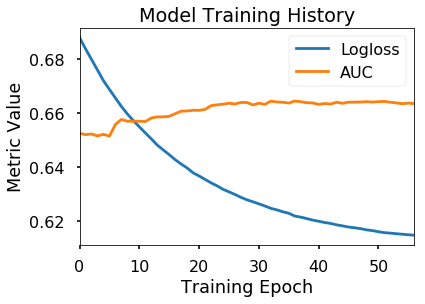


    
    
    ------------------------------------------------------------------------------------------
    	CLASSIFICATION REPORT:
    ------------------------------------------------------------------------------------------
    Accuracy:0.66
    Recall:0.00
    Precision:0.57
    AUC:0.66
    


<style  type="text/css" >
</style><table id="T_e496cc52_d453_11e9_9da3_f48e38b6371f" ><caption>Classification Report</caption><thead>    <tr>        <th class="blank level0" ></th>        <th class="col_heading level0 col0" >precision</th>        <th class="col_heading level0 col1" >recall</th>        <th class="col_heading level0 col2" >f1-score</th>        <th class="col_heading level0 col3" >support</th>    </tr></thead><tbody>
                <tr>
                        <th id="T_e496cc52_d453_11e9_9da3_f48e38b6371flevel0_row0" class="row_heading level0 row0" >0</th>
                        <td id="T_e496cc52_d453_11e9_9da3_f48e38b6371frow0_col0" class="data row0 col0" >0.6567</td>
                        <td id="T_e496cc52_d453_11e9_9da3_f48e38b6371frow0_col1" class="data row0 col1" >0.9981</td>
                        <td id="T_e496cc52_d453_11e9_9da3_f48e38b6371frow0_col2" class="data row0 col2" >0.7922</td>
                        <td id="T_e496cc52_d453_11e9_9da3_f48e38b6371frow0_col3" class="data row0 col3" >6352</td>
            </tr>
            <tr>
                        <th id="T_e496cc52_d453_11e9_9da3_f48e38b6371flevel0_row1" class="row_heading level0 row1" >1</th>
                        <td id="T_e496cc52_d453_11e9_9da3_f48e38b6371frow1_col0" class="data row1 col0" >0.5714</td>
                        <td id="T_e496cc52_d453_11e9_9da3_f48e38b6371frow1_col1" class="data row1 col1" >0.0048</td>
                        <td id="T_e496cc52_d453_11e9_9da3_f48e38b6371frow1_col2" class="data row1 col2" >0.0095</td>
                        <td id="T_e496cc52_d453_11e9_9da3_f48e38b6371frow1_col3" class="data row1 col3" >3331</td>
            </tr>
            <tr>
                        <th id="T_e496cc52_d453_11e9_9da3_f48e38b6371flevel0_row2" class="row_heading level0 row2" >micro avg</th>
                        <td id="T_e496cc52_d453_11e9_9da3_f48e38b6371frow2_col0" class="data row2 col0" >0.6564</td>
                        <td id="T_e496cc52_d453_11e9_9da3_f48e38b6371frow2_col1" class="data row2 col1" >0.6564</td>
                        <td id="T_e496cc52_d453_11e9_9da3_f48e38b6371frow2_col2" class="data row2 col2" >0.6564</td>
                        <td id="T_e496cc52_d453_11e9_9da3_f48e38b6371frow2_col3" class="data row2 col3" >9683</td>
            </tr>
            <tr>
                        <th id="T_e496cc52_d453_11e9_9da3_f48e38b6371flevel0_row3" class="row_heading level0 row3" >macro avg</th>
                        <td id="T_e496cc52_d453_11e9_9da3_f48e38b6371frow3_col0" class="data row3 col0" >0.614</td>
                        <td id="T_e496cc52_d453_11e9_9da3_f48e38b6371frow3_col1" class="data row3 col1" >0.5015</td>
                        <td id="T_e496cc52_d453_11e9_9da3_f48e38b6371frow3_col2" class="data row3 col2" >0.4008</td>
                        <td id="T_e496cc52_d453_11e9_9da3_f48e38b6371frow3_col3" class="data row3 col3" >9683</td>
            </tr>
            <tr>
                        <th id="T_e496cc52_d453_11e9_9da3_f48e38b6371flevel0_row4" class="row_heading level0 row4" >weighted avg</th>
                        <td id="T_e496cc52_d453_11e9_9da3_f48e38b6371frow4_col0" class="data row4 col0" >0.6273</td>
                        <td id="T_e496cc52_d453_11e9_9da3_f48e38b6371frow4_col1" class="data row4 col1" >0.6564</td>
                        <td id="T_e496cc52_d453_11e9_9da3_f48e38b6371frow4_col2" class="data row4 col2" >0.5229</td>
                        <td id="T_e496cc52_d453_11e9_9da3_f48e38b6371frow4_col3" class="data row4 col3" >9683</td>
            </tr>
    </tbody></table>


    
    
    


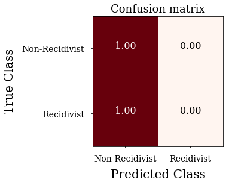


    
    
    ------------------------------------------------------------------------------------------
    	FEATURE IMPORTANCE:
    ------------------------------------------------------------------------------------------
    


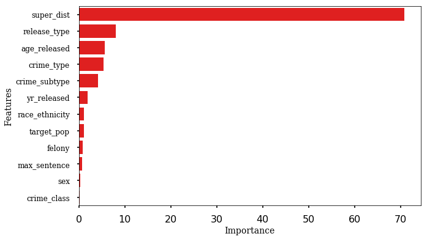


### Notes Following Initial Modeling:
- The ROC-AUC Curve Shows that our model performs better than chance. 
- HOWEVER, There is a major issue with our confusion matrix.
    - There are an extremely high # of False Negatives (prisoners Predicted to be "Non-Recidivist",but were actually "Recidivist")
    - This is a serious flaw with the model and serious hinders real-world applicability. 
- This may be due to the imbalance of cases of recidivists vs non-recidivists in our dataset.

# REVISING THE MODEL
## Balancing Target Classes Using Synthetic Minority Oversampling

### Addressing Class Imbalance
- Adding Synthetic Minority Oversampling Technique to balance out the # of recidivists(1) and non-recidivists(0)


```python
from imblearn.over_sampling import SMOTE

# Define X and y 
X = df_to_split
y = pd.Series(df[target_col].to_numpy().ravel())
y.name = 'recidivist'

print(f'Class counts before SMOTE:')
print(pd.Series(y).value_counts())

X_resampled, y_resampled = SMOTE().fit_sample(X,y)


print(f'\nClass counts after SMOTE:')
print(pd.Series(y_resampled).value_counts())

# Reformatting SMOTE transformed data
X_resampled = pd.DataFrame(X_resampled, columns = X.columns)

# X_resampled category columns back to integers
for header in category_cols:
    X_resampled[header] = X_resampled[header].astype('int')
    
# y_resampled back to a named series    
y_resampled = pd.Series(y_resampled)
y_resampled.name ='recidivist'
```

    Class counts before SMOTE:
    0    15880
    1     8326
    Name: recidivist, dtype: int64
    
    Class counts after SMOTE:
    1    15880
    0    15880
    dtype: int64
    

### Fitting a Revised Model with Balanced Classes


```python
from sklearn.model_selection import train_test_split

X_train, X_test, y_train, y_test = train_test_split(X_resampled, y_resampled, test_size=0.4)

from catboost import Pool, CatBoostClassifier
train_pool =  Pool(data=X_train, 
                   label=y_train,
                   cat_features=category_cols)
test_pool = Pool(data=X_test,
                 label=y_test, 
                 cat_features=category_cols)

cb_clf = CatBoostClassifier(iterations=300, depth=4,
                            boosting_type='Ordered',
                            learning_rate=0.03,
                            thread_count=-1,
                            eval_metric='AUC',
                            allow_const_label=True,
                           silent=True)#,
#                            logging_level='Info')#,
                           #task_type='GPU')
```


```python
cb_clf.fit(train_pool,eval_set=test_pool, plot=False, early_stopping_rounds=20)
cb_clf.best_score_
```


    {'learn': {'Logloss': 0.5550135153025292},
     'validation': {'Logloss': 0.5580049999452295, 'AUC': 0.7681174033200181}}


```python
df_results = ji.evaluate_catboost_model(cb_clf,X_train=X_train, X_test=X_test,
                                        test_pool=test_pool, y_train=y_train, y_test=y_test,
                                        conf_matrix_classes=['Non-Recidivist','Recidivist'])
```

    ------------------------------------------------------------------------------------------
    	TRAINING HISTORY:
    ------------------------------------------------------------------------------------------
    


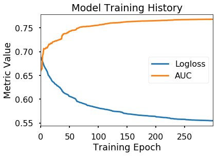


    
    
    ------------------------------------------------------------------------------------------
    	CLASSIFICATION REPORT:
    ------------------------------------------------------------------------------------------
    Accuracy:0.69
    Recall:0.66
    Precision:0.70
    AUC:0.77
    


<style  type="text/css" >
</style><table id="T_ee67ca7e_d453_11e9_b45f_f48e38b6371f" ><caption>Classification Report</caption><thead>    <tr>        <th class="blank level0" ></th>        <th class="col_heading level0 col0" >precision</th>        <th class="col_heading level0 col1" >recall</th>        <th class="col_heading level0 col2" >f1-score</th>        <th class="col_heading level0 col3" >support</th>    </tr></thead><tbody>
                <tr>
                        <th id="T_ee67ca7e_d453_11e9_b45f_f48e38b6371flevel0_row0" class="row_heading level0 row0" >0</th>
                        <td id="T_ee67ca7e_d453_11e9_b45f_f48e38b6371frow0_col0" class="data row0 col0" >0.6724</td>
                        <td id="T_ee67ca7e_d453_11e9_b45f_f48e38b6371frow0_col1" class="data row0 col1" >0.7154</td>
                        <td id="T_ee67ca7e_d453_11e9_b45f_f48e38b6371frow0_col2" class="data row0 col2" >0.6932</td>
                        <td id="T_ee67ca7e_d453_11e9_b45f_f48e38b6371frow0_col3" class="data row0 col3" >6303</td>
            </tr>
            <tr>
                        <th id="T_ee67ca7e_d453_11e9_b45f_f48e38b6371flevel0_row1" class="row_heading level0 row1" >1</th>
                        <td id="T_ee67ca7e_d453_11e9_b45f_f48e38b6371frow1_col0" class="data row1 col0" >0.7009</td>
                        <td id="T_ee67ca7e_d453_11e9_b45f_f48e38b6371frow1_col1" class="data row1 col1" >0.6568</td>
                        <td id="T_ee67ca7e_d453_11e9_b45f_f48e38b6371frow1_col2" class="data row1 col2" >0.6781</td>
                        <td id="T_ee67ca7e_d453_11e9_b45f_f48e38b6371frow1_col3" class="data row1 col3" >6401</td>
            </tr>
            <tr>
                        <th id="T_ee67ca7e_d453_11e9_b45f_f48e38b6371flevel0_row2" class="row_heading level0 row2" >micro avg</th>
                        <td id="T_ee67ca7e_d453_11e9_b45f_f48e38b6371frow2_col0" class="data row2 col0" >0.6858</td>
                        <td id="T_ee67ca7e_d453_11e9_b45f_f48e38b6371frow2_col1" class="data row2 col1" >0.6858</td>
                        <td id="T_ee67ca7e_d453_11e9_b45f_f48e38b6371frow2_col2" class="data row2 col2" >0.6858</td>
                        <td id="T_ee67ca7e_d453_11e9_b45f_f48e38b6371frow2_col3" class="data row2 col3" >12704</td>
            </tr>
            <tr>
                        <th id="T_ee67ca7e_d453_11e9_b45f_f48e38b6371flevel0_row3" class="row_heading level0 row3" >macro avg</th>
                        <td id="T_ee67ca7e_d453_11e9_b45f_f48e38b6371frow3_col0" class="data row3 col0" >0.6866</td>
                        <td id="T_ee67ca7e_d453_11e9_b45f_f48e38b6371frow3_col1" class="data row3 col1" >0.6861</td>
                        <td id="T_ee67ca7e_d453_11e9_b45f_f48e38b6371frow3_col2" class="data row3 col2" >0.6857</td>
                        <td id="T_ee67ca7e_d453_11e9_b45f_f48e38b6371frow3_col3" class="data row3 col3" >12704</td>
            </tr>
            <tr>
                        <th id="T_ee67ca7e_d453_11e9_b45f_f48e38b6371flevel0_row4" class="row_heading level0 row4" >weighted avg</th>
                        <td id="T_ee67ca7e_d453_11e9_b45f_f48e38b6371frow4_col0" class="data row4 col0" >0.6868</td>
                        <td id="T_ee67ca7e_d453_11e9_b45f_f48e38b6371frow4_col1" class="data row4 col1" >0.6858</td>
                        <td id="T_ee67ca7e_d453_11e9_b45f_f48e38b6371frow4_col2" class="data row4 col2" >0.6856</td>
                        <td id="T_ee67ca7e_d453_11e9_b45f_f48e38b6371frow4_col3" class="data row4 col3" >12704</td>
            </tr>
    </tbody></table>


    
    
    


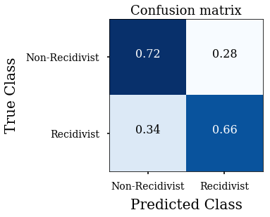


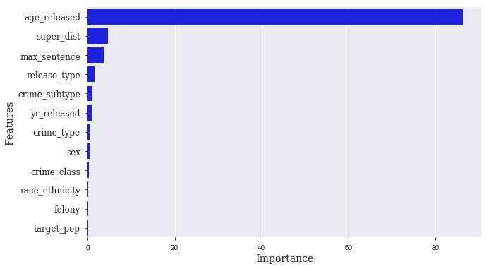


    
    
    ------------------------------------------------------------------------------------------
    	FEATURE IMPORTANCE:
    ------------------------------------------------------------------------------------------
    


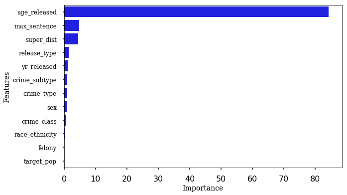


```python
# cb_clf.plot_tree(1, pool=test_pool,)
```

# Summary Visuals

- Plotting histograms for top 4 most important features by recividist


```python
## Mape inverse_map for coded categories to plot
inverse_map = {'age_released':{v:k for k,v in age_map.items()},
    'recidivist':{v:k for k,v in recidivist_map.items()}}

# Create df_plot, save age_code column
df_plot = df.copy()
df_plot['age_code'] = df_plot['age_released'].copy()

# Inverse-map original columns names
for k,mapper in inverse_map.items():
    df_plot[k] = df_plot[k].apply(lambda x: mapper[x])

# Drop cols, preview df_plot
df_plot.drop('index',axis=1,inplace=True)
df_plot.head()
```


<div>
<style scoped>
    .dataframe tbody tr th:only-of-type {
        vertical-align: middle;
    }

    .dataframe tbody tr th {
        vertical-align: top;
    }

    .dataframe thead th {
        text-align: right;
    }
</style>
<table border="1" class="dataframe">
  <thead>
    <tr style="text-align: right;">
      <th></th>
      <th>yr_released</th>
      <th>report_year</th>
      <th>race_ethnicity</th>
      <th>age_released</th>
      <th>crime_class</th>
      <th>crime_type</th>
      <th>crime_subtype</th>
      <th>release_type</th>
      <th>super_dist</th>
      <th>recidivist</th>
      <th>target_pop</th>
      <th>sex</th>
      <th>felony</th>
      <th>max_sentence</th>
      <th>crime_types_combined</th>
      <th>crime_class_type_subtype</th>
      <th>age_code</th>
    </tr>
  </thead>
  <tbody>
    <tr>
      <th>0</th>
      <td>2010</td>
      <td>2013</td>
      <td>Black</td>
      <td>25-34</td>
      <td>C Felony</td>
      <td>Violent</td>
      <td>Robbery</td>
      <td>Parole</td>
      <td>7JD</td>
      <td>Yes</td>
      <td>1</td>
      <td>0</td>
      <td>1</td>
      <td>10.0</td>
      <td>Violent_Robbery</td>
      <td>C Felony_Violent_Robbery</td>
      <td>1</td>
    </tr>
    <tr>
      <th>1</th>
      <td>2010</td>
      <td>2013</td>
      <td>White</td>
      <td>25-34</td>
      <td>D Felony</td>
      <td>Property</td>
      <td>Theft</td>
      <td>Discharged – End of Sentence</td>
      <td>unknown</td>
      <td>Yes</td>
      <td>0</td>
      <td>0</td>
      <td>1</td>
      <td>5.0</td>
      <td>Property_Theft</td>
      <td>D Felony_Property_Theft</td>
      <td>1</td>
    </tr>
    <tr>
      <th>2</th>
      <td>2010</td>
      <td>2013</td>
      <td>White</td>
      <td>35-44</td>
      <td>B Felony</td>
      <td>Drug</td>
      <td>Trafficking</td>
      <td>Parole</td>
      <td>5JD</td>
      <td>Yes</td>
      <td>1</td>
      <td>0</td>
      <td>1</td>
      <td>50.0</td>
      <td>Drug_Trafficking</td>
      <td>B Felony_Drug_Trafficking</td>
      <td>2</td>
    </tr>
    <tr>
      <th>3</th>
      <td>2010</td>
      <td>2013</td>
      <td>White</td>
      <td>25-34</td>
      <td>B Felony</td>
      <td>Other</td>
      <td>Other Criminal</td>
      <td>Parole</td>
      <td>6JD</td>
      <td>No</td>
      <td>1</td>
      <td>0</td>
      <td>1</td>
      <td>50.0</td>
      <td>Other_Other Criminal</td>
      <td>B Felony_Other_Other Criminal</td>
      <td>1</td>
    </tr>
    <tr>
      <th>4</th>
      <td>2010</td>
      <td>2013</td>
      <td>Black</td>
      <td>35-44</td>
      <td>D Felony</td>
      <td>Violent</td>
      <td>Assault</td>
      <td>Discharged – End of Sentence</td>
      <td>unknown</td>
      <td>Yes</td>
      <td>0</td>
      <td>0</td>
      <td>1</td>
      <td>5.0</td>
      <td>Violent_Assault</td>
      <td>D Felony_Violent_Assault</td>
      <td>2</td>
    </tr>
  </tbody>
</table>
</div>


```python
# Plot age
ji.plot_hist_by_group(df_plot,groupby_col='age_code',
                      label_map=inverse_map['age_released'], 
                      title='Recidivism by Age');
# Plot judicial district
ji.plot_hist_by_group(df_plot,groupby_col='super_dist',barh=True,rot=0,
                      label_map=None, xlabel='District',
                      title='Recidivism by Judicial District');
# Plot max sentence
ji.plot_hist_by_group(df_plot,groupby_col='max_sentence',
                      label_map=None,xlabel='Years', 
                      title='Recidivism by Maximum Sentence');
# Plot Release Type
ji.plot_hist_by_group(df_plot,groupby_col='release_type',barh=True,rot=0,figsize=(12,6),
                      label_map=None,xlabel='Release Type',
                      title='Recidivism by Type of Release');
```


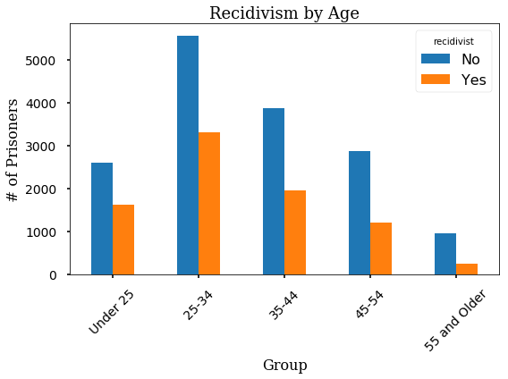


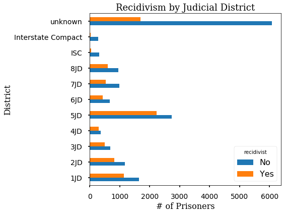


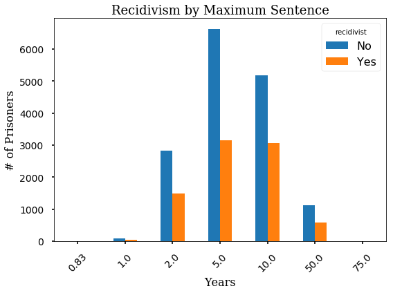


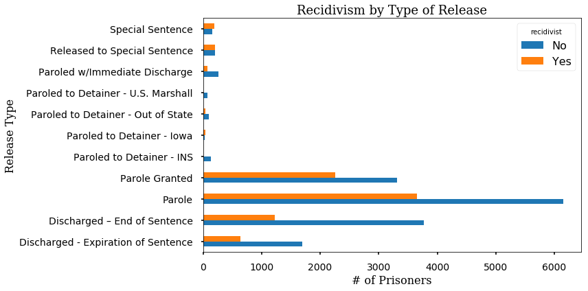


# CONCLUSIONS
- **After adjusting for imbalanced classes, the most important factor for determining recidivism are:**
    - **Age at Release**
    - **Supervising Judicial District**
    - **Release Type**
    - **Crime Subtype**
    
    
## Recommendatons
- This model could be used to predict which prisoners due for release may at the greatest risk for recidivism.<br><br>
    - Using this knowledge, the state of Iowa could put new programs into action that target those at high risk for recidivism and provide additional assistance and guidance following release.<br><br>
    - Additionally, there could be additional counseling or education _prior_ to release to supply the inmate with tools and options to avoid returning to a life of crime.
    
# FUTURE DIRECTIONS
- With more time and reliable performance, would perform cross-validation of our final model.<br><br>
- An additional model to predict the types of crimes types committed by recidivists.
