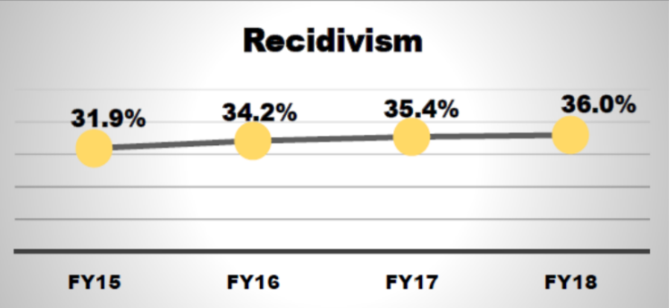
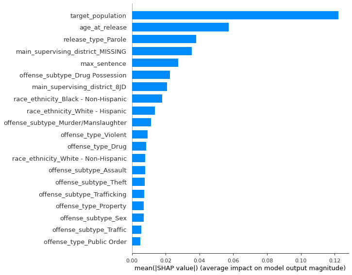

<a name='title'></a>

# Predicting Prisoner Recidivism in Iowa
## Identifying Risk Factors with Machine Learning

**Author**: James M. Irving, Ph.D.


### Business problem:


- The state of Iowa has had a prisoner recidivism issue that has become an increasing problem over several decades, with recidivism rates over 35% in 2007-2009.  While there was a period of gradual reduction from 2010-2014, there was a major jump in recidivism in 2015-2016.


- In 2015, US Dept. of Justice gave Iowa a $3 million Grant to help reduce recividism. At the time, 31.9% of  all released prisoners from Iowa were returning to prison within 3 years of being released.
Despite this investment, the recidivism rate has continued to clime, reaching 36% by 2018.




- *Recidivism statistics and visualizations above are from the [Iowa Department of Corrections Annual Report 2018](https://doc.iowa.gov/document/fy-2018-corrections-annual-report)*


- In order the better address the increase in prisoner recidivism, the Iowa State Department of Corrections has released data regarding which prisoners return to jail within 3 years of release, in the hopes of finding insights for areas of possible intervention.

### Project Goal
- Our goals for this analysis was two-fold: 
    1. Build a machine learning model that could predict which released prisoners will become recidivists/return-to-prison within 3 years of release.
    2. To identify which of the prisoner's demographics/features best predicts/explains which prisoners become recidivists.


### Data 

- Source: 
    - https://www.kaggle.com/slonnadube/recidivism-for-offenders-released-from-prison
- Original/Up-to-date Source: 
    - https://data.iowa.gov/Correctional-System/3-Year-Recidivism-for-Offenders-Released-from-Pris/mw8r-vqy4
- **Statistics about recidivism in prisoners from a 3 year prisoner**

#### **Target:**
- Recidivism - Return to Prison
    - No = No Recidivism; 
    - Yes = Prison admission for any reason within the 3-year tracking period

#### **Features:**
<!--     - Fiscal Year Released
    - Recidivism Reporting Year
    - Race - Ethnicity
    - Age At Release
    - Convicting Offense Classification
    - Convicting Offense Type
    - Convicting Offense Subtype
    - Main Supervising District
    - Release Type
    - Release type: Paroled to Detainder united
    - Part of Target Population -->

- ~~**Fiscal Year Released**~~ [Not used in model]
    - Fiscal year (year ending June 30) for which the offender was released from prison.

- ~~**Recidivism Reporting Year**~~ [Not used in model]
    - Fiscal year (year ending June 30) that marks the end of the 3-year tracking period. For example, offenders exited prison in FY 2012 are found in recidivism reporting year FY 2015.

- **Race - Ethnicity**
    - Offender's Race and Ethnicity

- **Convicting Offense Classification**
    - Maximum penalties: A Felony = Life; B Felony = 25 or 50 years; C Felony = 10 years; D Felony = 5 years; Aggravated Misdemeanor = 2 years; Serious Misdemeanor = 1 year; Simple Misdemeanor = 30 days

- **Convicting Offense Type**
    - General category for the most serious offense for which the offender was placed in prison.

- **Convicting Offense Subtype**
    - Further classification of the most serious offense for which the offender was placed in prison.

- **Release Type**
    - Reasoning for Offender's release from prison.

- **Main Supervising District**
    - The Judicial District supervising the offender for the longest time during the tracking period.


- **Part of Target Population** 
    - The Department of Corrections has undertaken specific strategies to reduce recidivism rates for prisoners who are on parole and are part of the target population.


#### Missing Values


- There were many missing values for the main suprivising judicial district column. Since these values may be missing for a meaningful reason (e.g. prisoners were not assigned a superivising district), I imputed them with a new "MISSING" category. 


## Methods

- Features related to the crime committed after release and the time until return to jail were removed, since they are not appropriate to use to predict who will be a recidivist. 
    - All features were categorical, except for age, which was converted to a numeric vallue (e.g. "35 - 45"-> 40).


- Used multiple machine learning models to find model with the best recall score for correctly identify which prisoners will return to jain.
    - Logisitic Regression
    - Random Forest
    - Catboost 
    - Support Vector Classifier 
    - XGBoost Classifier


- There were several aspects of the dataset that made difficult to produce a model that could break .60 recall for recidivists. 
    - The large number of categorical features (only 1 final feature was continuous/numeric) 
    - The classes were imbalanced (66% non-recidivist to 33% recidivist), which we addressed via 2 approaches: using class weights as well as oversampling with SMOTENC.

- After identifying our best model, we used model explainers, such as the SHAP package to better understand the relationship between the features and the target.


## Results

<!-- 
### Logistic Regression

- Interpretation

### SVC

- Interpretation -->

### Baseline Moddel - Dummy Classififer

- Since the dataset was fairly imbalanced (66:33 recidivist:non-recidivist), we first created a DummyClassifier set to use the stratified strategy, in which is guesses randomly based on the target's class balance. 

- The DummyClassifier performed terribly, as expected, with an accuracy score of 0.54, with an ROC-AUC of 0.47. The ROC AUC confirms this model is worthless.
- In terms of identifying recidivists ("Yes-Recid"), our baseline recall for recidivists was 0.31 with a precision score of 0.25. 
- Translated into words, this means that:
    - of all of the recidivists, our model correctly identified 0.31% of them (recall)- Of all of the model's predictions for our target class, only 25% of them are correct (precision).
- This is obviously a terrible model, so any model with greater scores will be better than random chance.


### Random Forest - Class Weights


- Due to the glass-box nature of the model and the power of ensemble methods, we started with RandomForestClassifiers. 

- RandomForestClassifiers struggled to learn about the target 1 class, recidivist prisoners (Return to Prison==Yes)
- Even though this model is horribly biased towards predicting non-recidivist, it still is a dramatic improvement over our basement DummyClassifier.

### Best Random Forest - Resampled Data

- In order to better address class balance, we oversampled the training data with SMOTENC.


- Oversampling the training data with SMOTENC improved the model's performance
    - Recall increased to 0.53 for recidivists
    - Accuracy increased to .74
    - ROC-AUC increased to 0.75

### Other Models 

- We spent time tuning various other model types, but in the end XGBoost's RandomForest Classifier was our best performing model.
- Other models used:
    - Logistic Regression
    - LinearSVC
    - Catboost


### Best Recidivist Recall Model - XGBoost Random Forests


- XGBoost's RandomForest Classifier outperformaned sklearn's RandomForests significantly, in terms of recall, which increased from 0.53 to 0.71 with xgboost. 
- However, this came at a tradde off of increased false positives, which lowred our overall accuracy to 0.63 and our ROC-AUC to 0.64.
- Despite the decrease in other metrics, we still selected the xgboost random forest classifier as our best model to use for inferences into what may be contributing towards recidivism. 

## Interpretation

#### Top Features - XGBoost RF Importances
 


- According to the inherent importances from our best model, the following are the 5 most important features for predicting recidivists:
    1. main_supervising_district_MISSING
    2. target_population
    3. offense_subtype_Drug Possession
    4. main_supervising_district_8JD
    5. offense_subtype_Murder/Manslaughter
- The remaining top features are various crime offense subtypes, race/ethnicities, and release types.

#### Top Features - SHAP Feature Importances
- We next used the SHAP package and its game-thoery-based approach to calculating the influence of each feature on the target's predictions. 
- This provides a more nuanced view of feature importances, but will also allow us to better understand the directionality of the relationship between our most important features and the likihood of predicting Yes-Recidivist.
    - Before examining this nuanced perspective, we will first compare top important features before visualizing the nuanced interactions.


- According to the Shapely values calculated by the SHAP package, the following 5 features and
    1. target_population
    2. age_at_release
    3. release_type_Parole
    4. main_supervising_district_MISSING
    5. max-sentence
    
- The remaining top features are various crime offense subtypes, race/ethnicities. 
- Interestingly, no release types appear in the top features, unlike our xgboost-identified features.
#### Relationship Between Top Features  & the Target

##### Shap Summary Plot of Important Features
**Interpreting `shap.summary_plot`**
> - Feature importance: Variables are ranked in descending order.
- Impact: The horizontal location shows whether the effect of that value is associated with a higher or lower prediction.
- Original value: Color shows whether that variable is high (in red) or low (in blue) for that observation.


- According to the Shapely values calculated by the SHAP package, the following 5 features had the following relationships with the target:
    1. `target_population`: 
        - Being part of the target_population, which was a group of prisoners already receiving additional interventions to prevent recidivism, actually makes the prisoner MORE likely to return to crime. 
        - While one could interpret this as the state's interventions not being effective, I suggest we instead use this to affirm that the state was correctly targeting at-risk prisoners already, at least partially. 
    2. `age_at_release`:
        - Unsurprisingly, the younger the prisoner is when released, the more likely they are to return to crime. 
        - This makes sense in a few ways. For one, the younger they are they less likely they are to be well-established in life and financially stable. 
    3. `release_type_Parole`:
        - Being released on Parole makes a prisoner less likely to return to crime. 
        - This makes sense, as parolees are monitored regularly by their parole officers, which would 
    4. `main_supervising_district_MISSING`:
        - Prisoners who were missing a supervising judicial district were LESS likely to return to crime. 
        - Future work: investigate which prisoners are assigned supervising judicial districts and which ones are not. 
        - There could be a logical reason that the prisoner may not need a supervising district, either due to the nature of their crime or release. Further investigation is warranted.
    5. `max-sentence`:
        - Max sentence has a more complicated relationship to the target. 
        - It seems that the criminals in prison for the  shortest-sentence crimes and the longest-sentence crimes seem to be more likely to return to crime.
        - Crimes that fall in the middle of the range of # of years tend to be less likely to return to crime.
    
<!-- - The remaining top features are various crime offense subtypes, race/ethnicities. 

- The 6th feature also is an interesting observation, as those who were in prison for Drug Offenses are more likely to return to crime. 
    - This is not surprising, as the war on drugs has disproportionately occupied US prisons with non-violent criminals. It is not surprisining these same individuals were caught  -->
____

<!-- #### Feature Importances


> The top 4 most important features for predicting recidivism are:
    1. Age At Release
    2. Supervising Judicial District
    3. Release Type
    4. Crime Type/Subtype -->


#### Age at Release


> Younger released prisoners are more likely to return to crime. 


#### Supervising Judicial District

> Some Superivising Judicial districts are more likely to produce recivists.

#### Release Type


#### Crime Type/Subtype


## Recommendations:

- Using our model,Iowa Department of corrections can predict which prisoners may become recidivist.
- Using this information, Iowa can implement pre-release educational programs to target at-risk prisoners, as well as provide  post-release support and intervention to at-risk prisoners. 
- Additionally, we highly recommend that the Iowa Dept of Corrections investigate the differences between the Supervising Judicial districts to better understand why it is a large factor in the prisoner's outcome. 


## Limitations & Next Steps

The lack of numerical features was a major hurdle. The next steps should be to pull in additional information regarding the judical districts and their associated counties (population/crime rate/income, etc). We considered applying neural networks but decided against it due to the black-box nature of artificial neural networks. 


### For further information
Please review the narrative of our analysis in [our jupyter notebook `project-notebook-iowa-prisoners.ipynb`](./project-notebook-iowa-prisoners.ipynb) or review our [presentation]("./Predicting Recidivism in Released Prisoner in Iowa_Final_v2.pdf")

For any additional questions, please contact **james.irving.phd@gmail.com**

<!-- 
##### Repository Structure:

Here is where you would describe the structure of your repoistory and its contents, for exampe:

```

├── README.md               <- The top-level README for reviewers of this project.
├── index.ipynb             <- narrative documentation of analysis in jupyter notebook
├── presentation.pdf        <- pdf version of project presentation
└── images
    └── images               <- both sourced externally and generated from code
└── data
    └── 

``` -->
