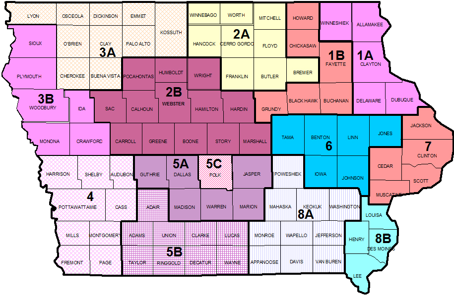

## Predicting Which Prisoner's will Return to a Life of Crime

A little info about your project and/ or overview that explains **what** the project is about.
Here we build a gradient boost decision tree classifier with Catboost to predict which prisoners become recidivists using primarily categorical data. 

## Motivation

The state of Iowa has been wrestling with a recidivism problem for many years, with a large portion of released prisoners reverting back to crime and back into the crinminal justice system. By 2015, nearly 1/3 of all released prisoners were being convicted of new offenses. The issue was so substantial that the U.S. Department of Justice gave Iowa a $3M grant to help fight this trend. However, as of FY2018, recidivism rates hit an all-time high (36.0%). 

The Iowa Department of Corrections has made data on released prisoners available on data.iowa.gov in the search for data-driven recommendations and solutions that may start to alleviate this problem. 

## Screenshots
Include logo/demo screenshot etc.

## Tech/framework used
Ex. -
* Catboost
* SHAP 

<b>Built with</b>
- [Electron](https://electron.atom.io)

## Features
Data on released prisoners contains almost entirely categorical features, which makes building accurate models more difficult.
Additionally, there is a large class imblanace issue, with 

**Features Analyzed:**
- **Fiscal Year Released**
    - Fiscal year (year ending June 30) for which the offender was released from prison.

- **Recidivism Reporting Year**
    - Fiscal year (year ending June 30) that marks the end of the 3-year tracking period. For example, offenders exited prison in FY 2012 are found in recidivism reporting year FY 2015.

- **Race - Ethnicity**
    - Offender's Race and Ethnicity

- **Convicting Offense Classification**
    - Maximum penalties: A Felony = Life; B Felony = 25 or 50 years; C Felony = 10 years; D Felony = 5 years; Aggravated Misdemeanor = 2 years; Serious Misdemeanor = 1 year; Simple Misdemeanor = 30 days

- **Convicting Offense Type**
    - General category for the most serious offense for which the offender was placed in prison.

- **Convicting Offense Subtype**
    - Further classification of the most serious offense for which the offender was placed in prison.

- **Release Type**
    - Reasoning for Offender's release from prison.

- **Main Supervising District**
    - The Judicial District supervising the offender for the longest time during the tracking period.

- **Recidivism - Return to Prison**
    - No = No Recidivism; Yes = Prison admission for any reason within the 3-year tracking period
    
- **Part of Target Population** 
    - The Department of Corrections has undertaken specific strategies to reduce recidivism rates for prisoners who are on parole and are part of the target population.
    ___

## Credits
Give proper credits. This could be a link to any repo which inspired you to build this project, any blogposts or links to people who contrbuted in this project. 

#### Anything else that seems useful

## License
A short snippet describing the license (MIT, Apache etc)

MIT © [Yourname]()